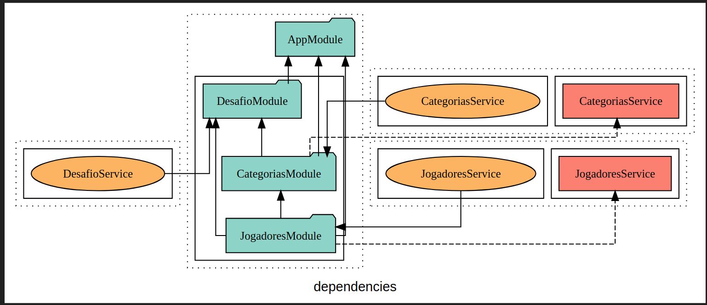

  

[circleci-image]: https://img.shields.io/circleci/build/github/nestjs/nest/master?token=abc123def456
[circleci-url]: https://circleci.com/gh/nestjs/nest
teste
  
## Description

Api criada para treinar microserviços utilizando nestJs e RabbitMq com nestJs
Abaixo mostro como está a estrutura da API(Sempre será atualizada)

31/01 ( Ainda é monolito)

01/02 ( Preparando estrutura para microservices)

